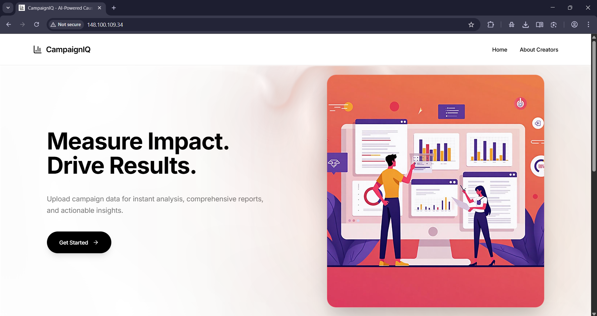
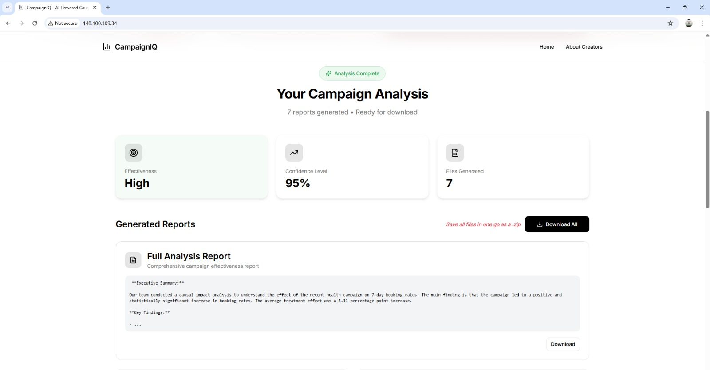
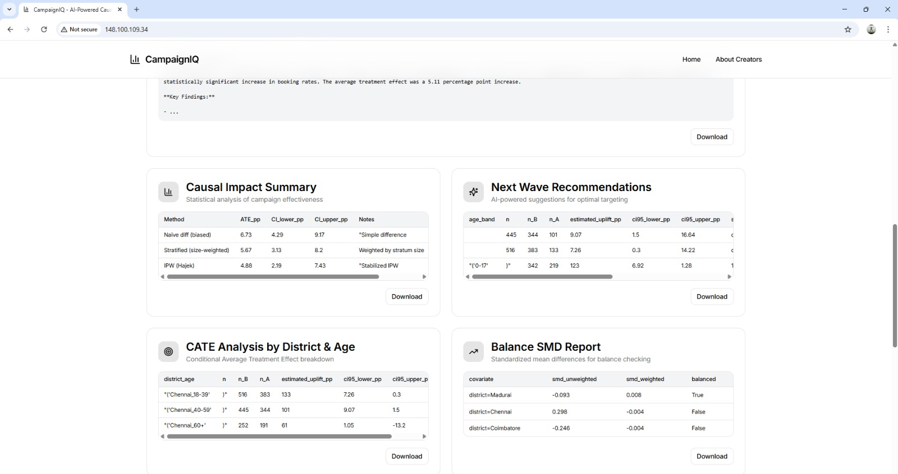
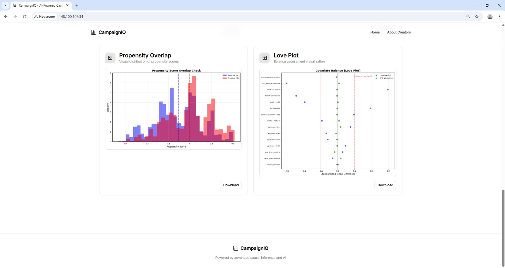
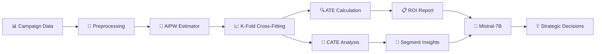

<div align="center">

# 📊 CampaignIQ

### *Causal Analytics for Public Health Impact*

[](http://148.100.109.34/)
[](LICENSE)
[](https://www.python.org/)
[](https://nodejs.org/)

### [🌐 Visit Full-Stack Prototype - http://148.100.109.34/](http://148.100.109.34/) (Deprecated)• Deployed on IBM LinuxONE Community Cloud
### [Download Test Dataset Here](https://github.com/MOHAMEDAHSAN/CampaignIQ/blob/main/v1/backend/campaign_dataset.csv)
---

### *Move beyond correlation. Measure true causal impact.*

CampaignIQ is a state-of-the-art analytical solution that leverages causal inference to provide health organizations with precise, unbiased measures of campaign metrics and actionable insights for strategic resource allocation.

</div>

---

## 📸 Platform Overview

<div align="center">

| Campaign Analytics Dashboard | Metrics |
|:---:|:---:|
|  |  |

| Segment Analysis | Causal Impact Visualization |
|:---:|:---:|
|  |  |

</div>

---

## 🎯 The Challenge

<table>
<tr>
<td width="50%">

### ❌ **The Problem**

Health organizations struggle to evaluate campaign effectiveness accurately:

- **Correlation ≠ Causation**: Simple comparisons mislead
- **Confounding Variables**: District, age, conditions skew results
- **Biased Assessments**: Unable to isolate true campaign impact
- **Resource Waste**: No data-driven allocation strategy

</td>
<td width="50%">

### ✅ **The Solution**

Advanced causal inference pipeline that delivers:

- **AIPW Estimator**: Doubly-robust causal measurement
- **K-Fold Cross-Fitting**: Statistical rigor & bias prevention
- **ATE & CATE Analysis**: Overall and segment-specific impact
- **Actionable Insights**: Data-driven resource optimization

</td>
</tr>
</table>

---

## 🔬 Technical Architecture



---

### IBM Z Community Cloud Use Case

The IBM Z Community Cloud provided the core infrastructure for deploying CampaignIQ, serving as a secure, reliable, and enterprise-grade platform for our full-stack data science application.

| Component/Feature | Role in CampaignIQ Project | Benefit & Advantage |
| :--- | :--- | :--- |
| **LinuxONE VM (s390x)** | Core infrastructure for hosting the entire application stack (Nginx, Flask, React). | Provided an **enterprise-grade, secure, and reliable platform**, ideal for handling sensitive data analysis and running AI workloads. |
| **Ubuntu 22.04 OS** | The operating system for installing all software (Python, Node.js, Nginx). | Offered a **familiar and standard Linux environment**, making development and deployment straightforward on the Z architecture. |
| **Public Networking** | Made the web application globally accessible via a public IP and secured the server using the `ufw` firewall. | Demonstrated **standard cloud networking capabilities**, allowing the project to be deployed and used like any modern web application. |
| **Production Stack** | Hosted a complete production-ready stack: **Nginx** as a reverse proxy, **Flask** for the backend API, and **PM2** as a process manager. | Showcased that the platform can run a **modern, robust software stack**, proving its versatility for data-driven web solutions. |

---

### **Core Methodology**

| Component | Description | Benefit |
|-----------|-------------|---------|
| **AIPW Estimator** | Augmented Inverse Propensity Weighting | Doubly-robust causal estimates |
| **Cross-Fitting** | K-fold validation during training | Prevents overfitting & reduces bias |
| **ATE** | Average Treatment Effect | Campaign-wide impact measurement |
| **CATE** | Conditional Average Treatment Effect | Segment-specific insights |

---

## 👥 Who Benefits?

<div align="center">

| 🎯 Program Managers | 🔬 Data Scientists | 🏛️ Health Officials |
|:---:|:---:|:---:|
| Use ROI insights to justify budgets and optimize campaigns | Build and validate the analytical engine with statistical rigor | Require defensible impact summaries for policy decisions |
| **Decision-makers** | **Technical experts** | **Stakeholders & funders** |

</div>

---

## 🚀 Quick Start

### **Prerequisites**

```bash
# Required software
✓ Node.js & npm
✓ Python 3.x & pip
```

### **⚙️ Configuration: Hugging Face Token** 🔑

The project requires a Hugging Face token for ML model access. Choose your preferred method:

<details>
<summary><b>📌 Method 1: Environment File (Recommended)</b></summary>

**Most secure - prevents token exposure in version control**

1. Create `.env` in the project root (`v1/.env`):
   ```bash
   HF_TOKEN="your_hugging_face_token_here"
   ```

2. Verify `.env` is in `.gitignore`

</details>

<details>
<summary><b>⚡ Method 2: Direct Code Entry (Quick Setup)</b></summary>

**Faster setup for development**

1. Open `v1/backend/causal_impact.py`
2. Navigate to line ~74 and update:
   ```python
   hf_token = os.environ.get("HF_TOKEN", "your_actual_token_here")
   ```

</details>

---

### **📦 Installation**

```bash
# 1. Clone the repository
git clone https://github.com/MOHAMEDAHSAN/CampaignIQ.git
cd CampaignIQ
```

```bash
# 2. Frontend setup (Terminal 1)
cd v1
npm install
npm run dev
```
```bash
# 3. Backend setup (Terminal 2)
pip install -r requirements.txt
python backend/app.py
```

---

## 📊 Sample Data

A comprehensive sample dataset is included for testing and demonstration:

📁 **Location**: [`v1/backend/campaign_dataset.csv`](https://github.com/MOHAMEDAHSAN/CampaignIQ/blob/main/v1/backend/campaign_dataset.csv)

---

## 📄 License

<div align="center">

**Distributed under the Apache License 2.0**

See [`LICENSE`](LICENSE) for complete terms and conditions.

---

### ⭐ Star this repo if CampaignIQ helps your organization!

**Built with ❤️ for public health impact measurement**

</div>


